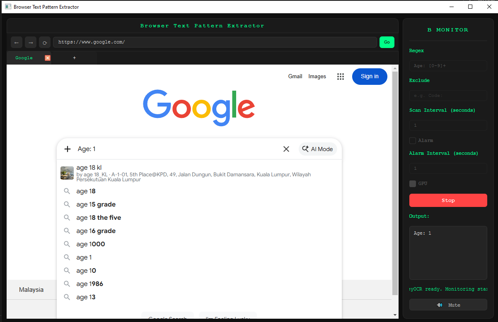
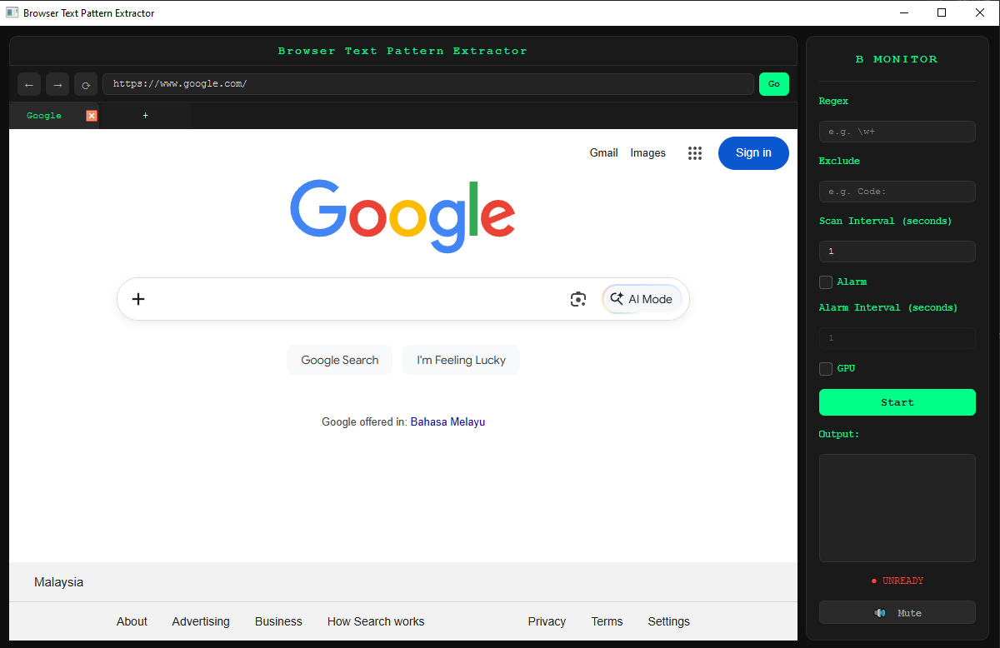
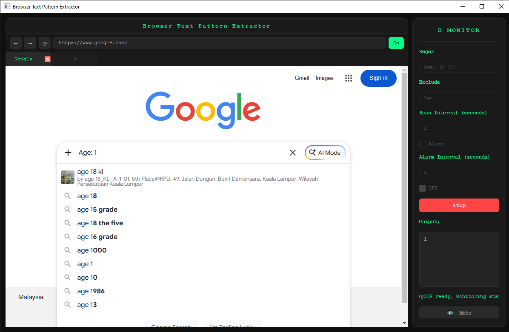
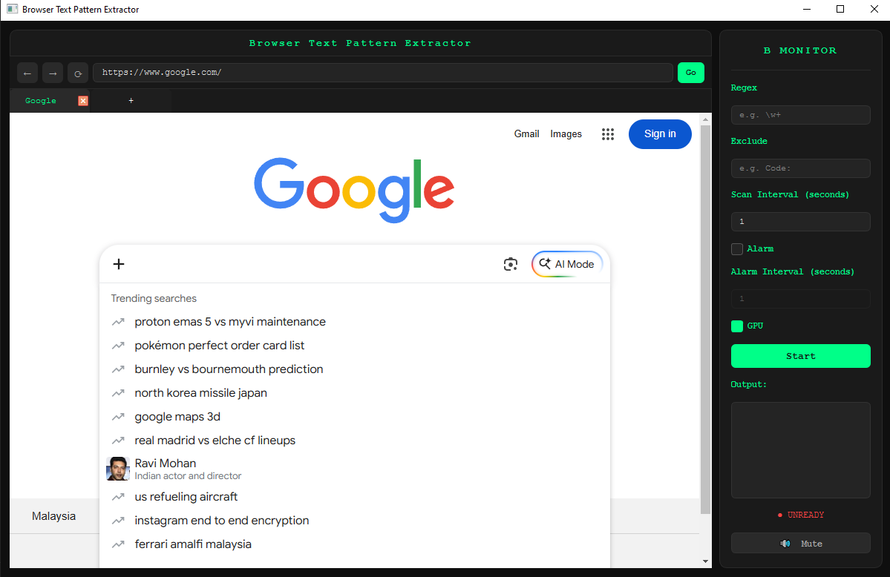
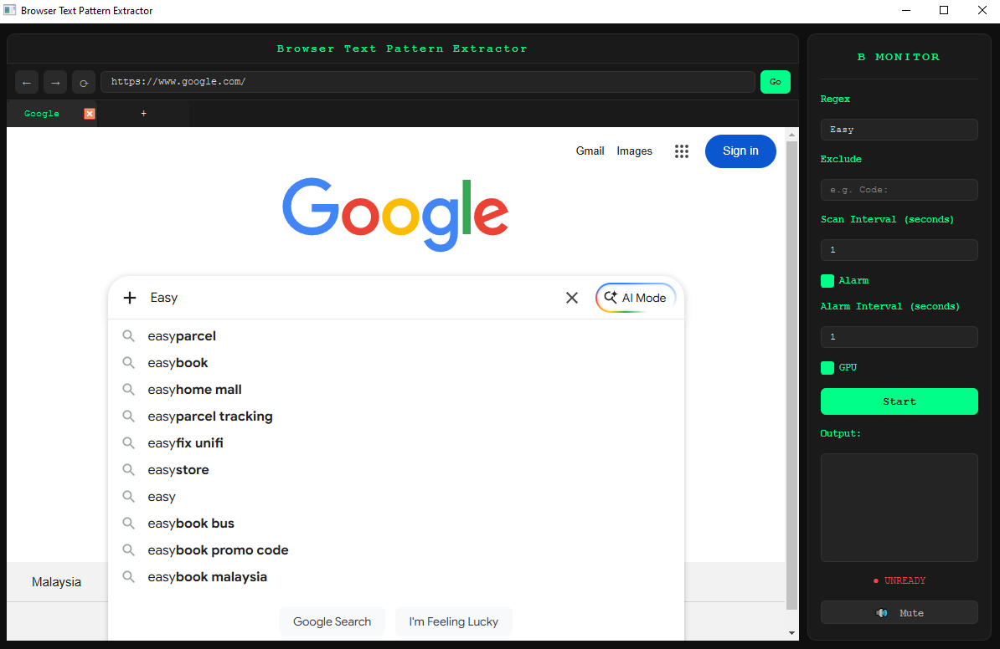
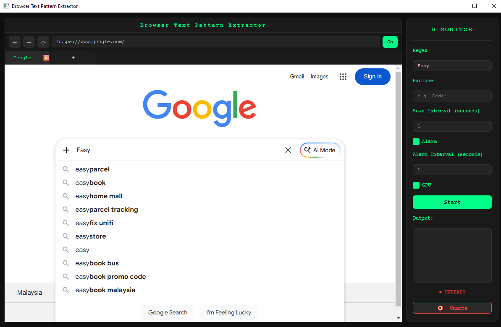

# Browser Text Pattern Extractor
A real-time browser-based OCR tool that extracts text from the current browser tab and filters it using regex patterns.
Using this for extracting some text under a certain pattern from videos, without watching the video.



---

## Requirements

- Windows OS.
- [Miniconda](https://docs.conda.io/en/latest/miniconda.html) or [Anaconda](https://www.anaconda.com/).
- NVIDIA GPU (optional).
- Note: Some functionality may not work such as the alarm on non-Windows and GPU on non-NVIDIA cards.

---

## Installation

### 1. Create and activate a Conda environment

```bash
conda create -n btpe python=3.10.19 conda
conda activate btpe
```
> Note: `conda activate btpe` provides the python environment.

### 2. Install PyQt6 and WebEngine

```bash
pip install PyQt6 PyQt6-WebEngine
```

### 3. Install EasyOCR

```bash
pip install easyocr
```

### 4. Install PyTorch — GPU users (NVIDIA only)

> First run `nvidia-smi` on your cmd or bash to check your CUDA version, then visit
> https://pytorch.org/get-started/locally/ for the exact command.
>
> Example for CUDA 13.0:
> ```bash
> pip install torch torchvision --index-url https://download.pytorch.org/whl/cu130 --force-reinstall
> ```
> ⚠️ The `--force-reinstall` flag is required — it ensures existing PyTorch packages are replaced with the correct CUDA-enabled build.
>
> Verify GPU is detected:
> ```bash
> python -c "import torch; print(torch.cuda.is_available())"
> ```
> Should print `True`.

> Note: This may cause some reinstallation on some libraries, that is normal.

---

## Running the App

```bash
conda activate btpe
python main.py
```
> **Note:** On first run, EasyOCR will automatically download its language models (~100MB). An internet connection is required for this one-time download.

---

## Usage



---

### 🌐 Browser
The browser works as a normal browser with url bar, tabs, back, next, and refresh.

---

### 🔍 Regex
Lets say what you are trying to extract are values that typically follow a certain pattern. For example:

```
Age: 19
```

You would fill the Regex field with:
```
Age: [0-9]+
```

Any text matching this pattern will be tracked and shown in the output.


---

### ✂️ Exclude
The Exclude field removes unwanted text from the matched pattern. Using the same example — if you only want the number and not the `Age:` prefix, fill the Exclude field with:

```
Age:
```

The output will then show only `19` instead of `Age: 19`.



---

### ⏱️ Scan Interval
The program works by repeatedly screenshotting the browser at a set interval. The scan interval defines how many seconds to wait between screenshots.

> **Note:** EasyOCR processing takes additional time, so the actual interval will be:
> `scan interval + EasyOCR processing time`.
>
> For example, a 1 second interval may effectively run every 1.5–2 seconds depending on your hardware.



---

### 🔔 Alarm
The alarm alerts you when matching text is found. The alarm interval controls the duration of the alarm sound.

**Behaviour:**
- When a match is found, the alarm plays for the full alarm interval duration.
- Any new matches found during the alarm will **not** extend or restart it.
- Once the alarm finishes, if matches are still being found, the alarm will trigger again.



---

### ⚡ GPU
The GPU checkbox is for users with an NVIDIA GPU. Enabling this improves EasyOCR processing speed, allowing text to be extracted faster and the overall program to run more responsively.

> See the [Installation](#installation) section for GPU setup instructions.

---

### 🔇 Mute
The mute button silences the alarm. Note that muting **only takes effect before the alarm starts** — if the alarm is already playing, it will finish before mute kicks in.


---

### ▶️ Start / Stop
Press **Start** to begin monitoring. EasyOCR may take a moment to load on first start — this is normal.

Press **Stop** to end monitoring and clear the output.

> 💡 Tip: All settings are locked while monitoring is active. Configure everything before hitting Start.